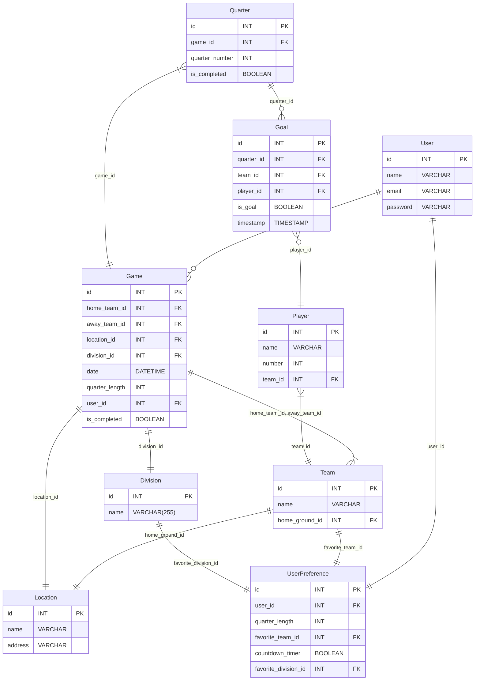

# Score Card
App for AFL goal umpires to keep track of game scores

# Architecture

*Architecture diagram available in project documentation*

# UI Mockup

Source: https://miro.com/app/board/uXjVMN7hQ4Q=/

*UI mockup available in external Miro board*

# Database Schema

