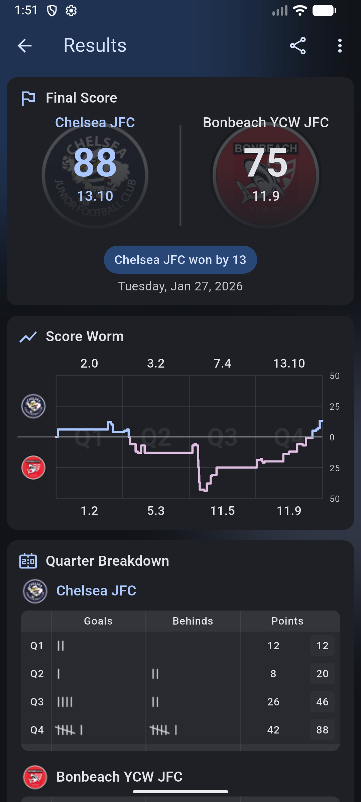
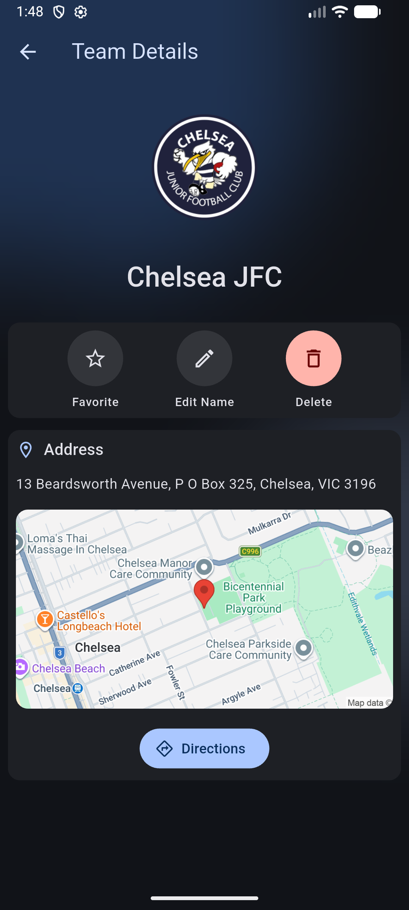

# Scorecard

> Modern AFL score tracking app for goal umpires and fans

[](https://github.com/ryannortham/scorecard/actions)
[](LICENSE)
[](https://flutter.dev)
[](https://dart.dev)

## Features

### Live Scoring

- Real-time goal and behind tracking for AFL matches
- Quarter-by-quarter score management with running totals
- Automatic points calculation and validation

### Score Visualisation

- Interactive score worm chart showing match flow
- Quarter-by-quarter breakdown and statistics
- Running differentials and momentum tracking

### Team Management

- Create and manage teams with logos and branding
- Mark multiple favourite teams for quick access
- Comprehensive team details and history

### Game History

- Save and review completed matches
- Search and filter past games
- Share results and statistics

## Screenshots

<table>
  <tr>
    <td><br/><em>Game Setup</em></td>
    <td><br/><em>Live Scoring</em></td>
    <td><br/><em>Game Results</em></td>
    <td><br/><em>Team Details</em></td>
  </tr>
</table>

## Quick Start

### For Users

Download from the Google Play Store (coming soon)

### For Developers

**Prerequisites:**

- Flutter 3.35.3 or higher
- Dart 3.9.2 or higher
- Android Studio or VS Code with Flutter extensions

**Installation:**

```bash
# Clone the repository
git clone https://github.com/ryannortham/scorecard.git
cd scorecard

# Install dependencies
make deps

# Run the app
flutter run
```

**Development Commands:**

```bash
make deps          # Install dependencies
make format        # Format code
make lint          # Run static analysis
make test          # Run tests
make build         # Build debug APK
make check         # Run all CI checks (format, lint, test)
```

## Built With

| Category             | Technology              |
|----------------------|-------------------------|
| **Framework**        | Flutter 3.35.3          |
| **Language**         | Dart 3.9.2              |
| **State Management** | Provider                |
| **UI Design**        | Material Design 3       |
| **Storage**          | SharedPreferences, Hive |
| **CI/CD**            | GitHub Actions          |
| **Deployment**       | Google Play Store       |

## Documentation

- **[Development Guide](docs/development.md)** - Detailed setup, build process, and development workflow
- **[Architecture](docs/architecture.md)** - Project structure, design patterns, and key services
- **[PlayHQ API](docs/playhq_api.md)** - PlayHQ GraphQL API documentation and integration details

## License

This project is licensed under the MIT License - see the [LICENSE](LICENSE) file for details.

## Acknowledgments

- [Material Design 3](https://m3.material.io/) by Google
- [Flutter](https://flutter.dev) framework and community
- [PlayHQ](https://www.playhq.com/) for team data integration
- Australian Football League community
